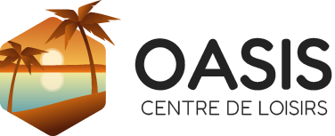

Une création de Yvan jr Blanchette

Dans le cadre du cours d'intégration d'interface utilisateur de l'AEC en développement web du cégep de Trois-Rivière

---

## Installation
#### API (PHP Laravel)
1. Cloner le repo de l'API
```git clone https://github.com/YvanBlanchette/oasis-api.git```
2. Installer les dépendances
```composer install```
3. Démarrer le serveur backend
```php artisan serve```


#### Frontend (Vue js)
1. Cloner le repo du frontend
```git clone https://github.com/YvanBlanchette/oasis.git```
2. Installer les dépendances
```npm install```
3. Démarrer le serveur frontend
```npm run dev```

---

## Mode développement
Utilisateurs pré-enregistrés
    

##### Administrateur
À accès au tableau de bord et toutes les opérations CRUD
Adresse courriel: admin@oasis.com
Mot de passe: password

##### Employé
À accès au tableau de bord mais ne peut rien supprimer
Adresse courriel: staff@oasis.com
Mot de passe: password

##### Client
Il n'a pas accès au tableau de bord
Adresse courriel: client@oasis.com
Mot de passe: password